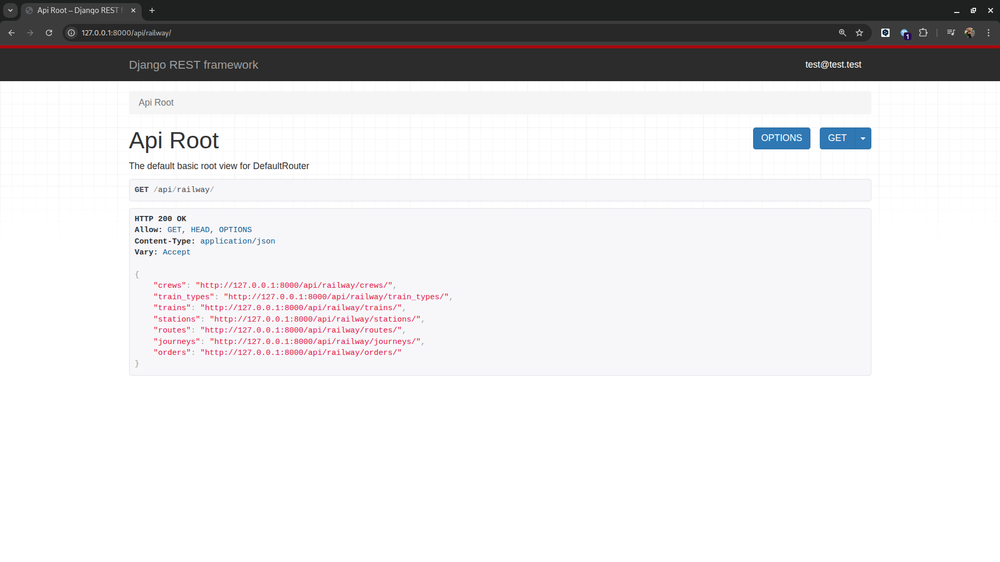
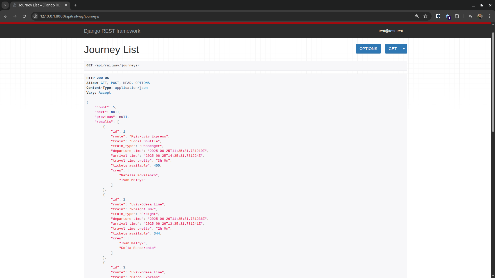
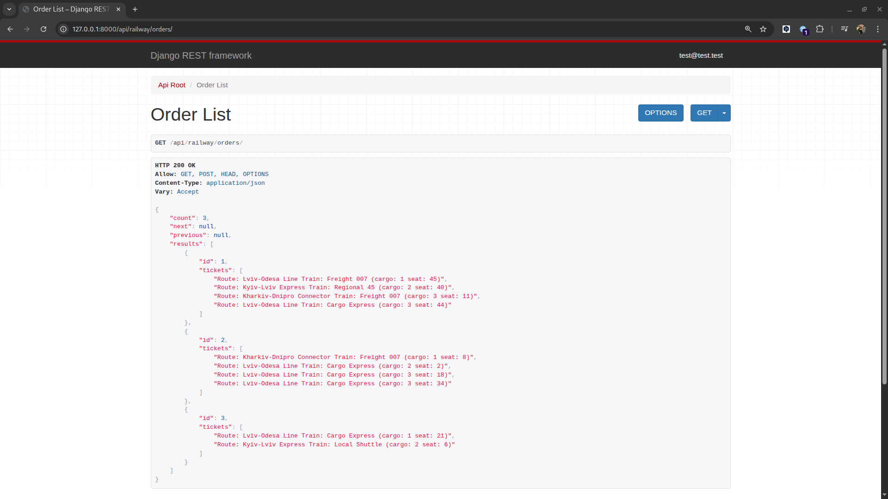
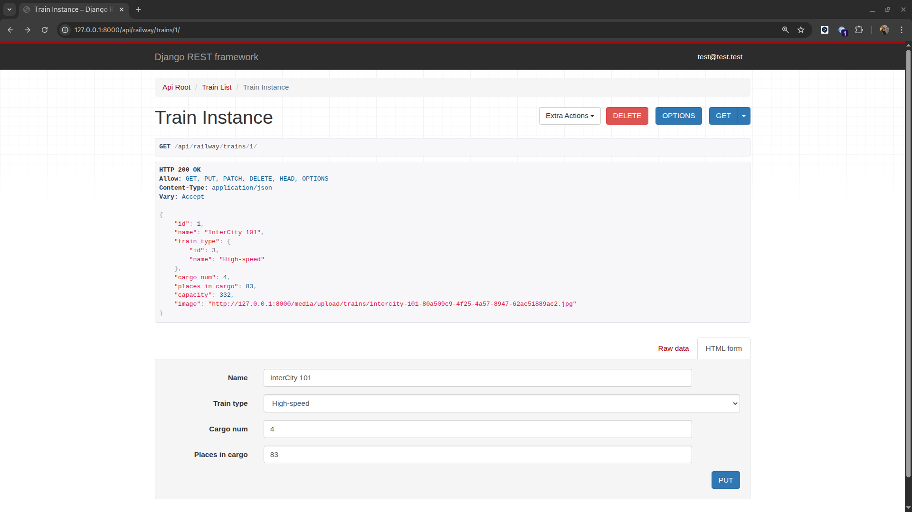
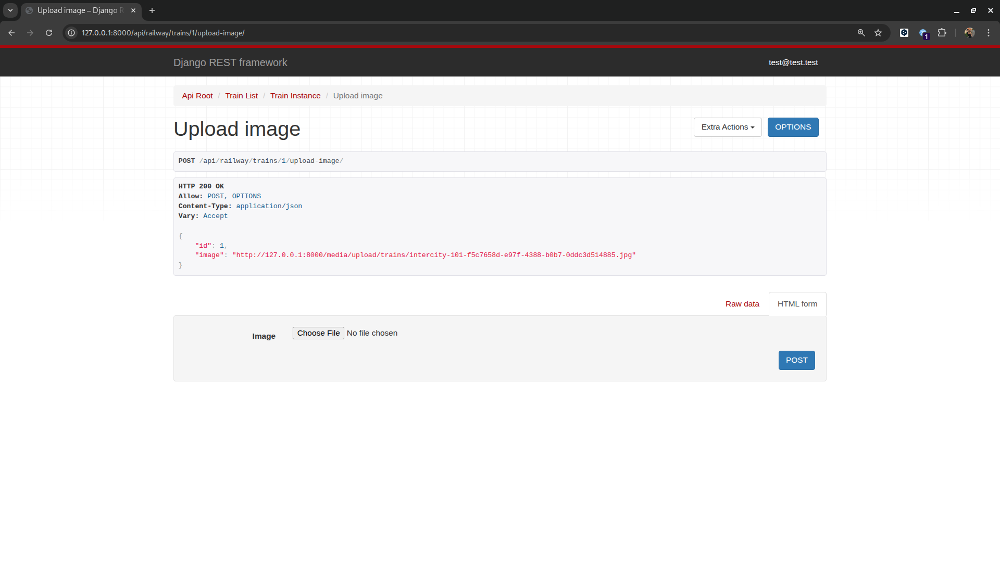

# 🚆 Train-Station-API-Service

> **Complicated system of managing trains, journeys, crew and stations.**

This is a full-featured backend project built during a Django REST Framework course to practice real-world backend development and API design.

## 🔗 Live Demo

_No public demo available yet. You can run it locally by following the setup instructions below._

---

## 🛠 Technologies Used

* 🐍 Python 3.12

* 🌐 Django 5.x

* 🧰 Django REST Framework

* 🐘 PostgreSQL (via Docker)

* 🐳 Docker & Docker Compose

* 🧪 Pytest / Django TestCase

* 📃 Swagger / drf-spectacular

* 🔑 JWT Authentication

* ✅ Custom Permissions & Throttling

* 👤 Custom user model (email as username)

---

## 🚀 Features

* 🔐 Authentication via email & password

* 🛤 Manage trains, routes, stations, journeys

* 🎫 Book tickets & place orders

* 👥 Assign crew to journeys

* 📊 Swagger-based API documentation

* 🛡 Custom permissions & rate limiting

* 🔎 Flexible filtering options for journeys (by train, route, date)  

* 🐳 Full Docker support for local development

* 🧪 Test coverage for main app logic

---

## ⚙️ Setup Instructions
`✅ Make sure Docker and docker-compose are installed.`
1. **Clone the repository**

```bash
git clone https://github.com/IhorDmytriv/train-station-api-service.git
cd train-station-api-service
```

2. **Create a `.env` file and add your environment variables (example)**

```bash
SECRET_KEY=your_secret_key_here
POSTGRES_USER=railway
POSTGRES_PASSWORD=railway
POSTGRES_DB=railway
POSTGRES_HOST=localhost
POSTGRES_PORT=5432
```
3. **🔐 Generating a Django SECRET_KEY**

```bash
python -c "from django.core.management.utils import get_random_secret_key; print(get_random_secret_key())"
```
- Then put it in your .env file.

4. **🐳 Build and run the project using Docker**

```bash
docker-compose up --build
```

5. **📥 Load initial test data (fixtures)**

```bash
docker-compose exec railway python manage.py loaddata train_servise_db_data.json
```

6. **🧪 Run tests**

```bash
docker-compose exec railway python manage.py test
```

7. **🌐 Access the project in your browser**

Open: http://localhost:8000/api/railway/

- Swagger API docs will be available at:

http://localhost:8000/api/schema/swagger-ui/


8. **⚠️ Getting access**
- create user via /api/user/create/
- get access token via /api/user/token/

---

## 📊 Screenshots
* Models Diagram

* API Root

* Journey List

* Order List

* Train Detail

* Train Upload-Image


---

## 👨 Author

* Ihor Dmytriv
* Built during a Django REST Framework course to practice backend web development

---

Feel free to contribute or fork the project!
